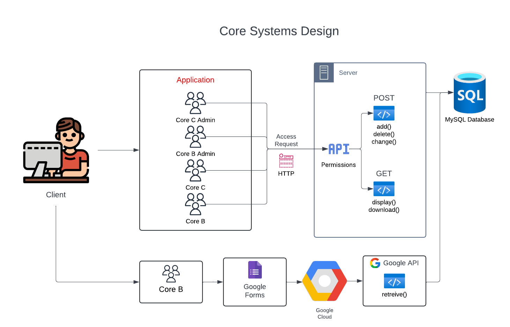
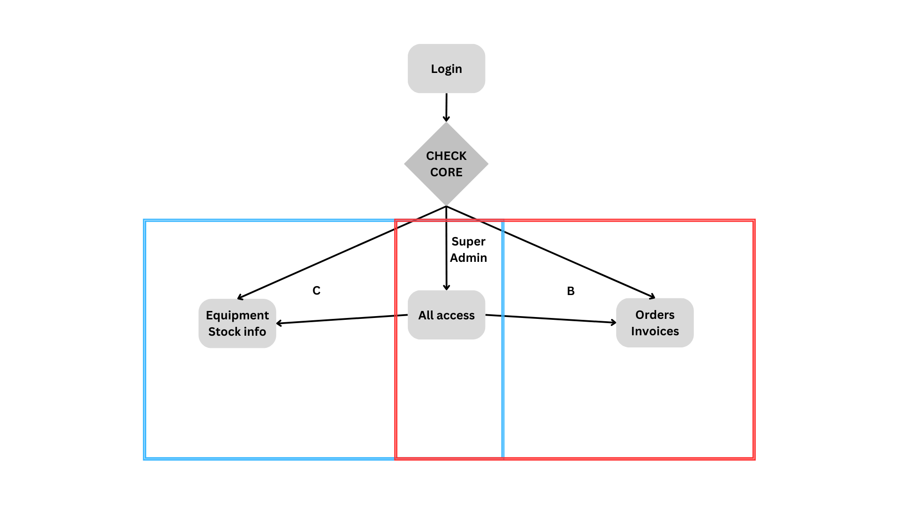

#  Core Systems Application
[![][black-shield]][black]

[black]: https://www.lsuhs.edu/centers/center-for-applied-immunology-and-pathological-processes/bioinformatics-modeling-core
[black-shield]: https://img.shields.io/badge/LSUHS-CAIPP_Modelling_Core-FFBF00.svg?style=for-the-badge&labelColor=purple
  
  


CoreSystemsApp is a comprehensive web application developed by the LSUHSC-CAIPP Core B team. It is designed to manage systems in Bioinformatics and Modeling Cores B and C, providing various core functionalities essential for these operations.



Ensures that users have appropriate permissions and can perform operations on the database safely. It involves client-side application logic, server-side processing, and communication via APIs.

## Table of Contents 
- [Setup](#Setup) 
- [Web App](#Web-App) 
    - [Login](#Login) 
    - [Core B](#Core-B) 
    - [Core C](#Core-C)
- [Reader](#Reader)
- [PdfWriter](#PdfWriter)

##  Setup

Python version required: 3.9.*

Create environment with:

`python3 -m venv <venv_name>`

or this for specific version of python installed:

`python3.9 -m venv <venv_name>`

Activate the environment with:

`source <venv_name>/bin/activate`

Install requirements with:

`pip install -r requirements.txt`

  

###  Mac OS

`brew install redis`

`brew services start redis`

  

###  Ubuntu

`sudo apt-get install redis`

  

##  Web App

The app is separated into a few parts based on access level required and functionality.

###  Login

You have to login into your account the access the app. Each user have different roles that grant specific access.

Login system is implemented with *flask_login* with added custom roles. The roles are:

- Admin

- User

- Core B

- Core C

Only super admins can add and delete users and other admins to the app. It can be done in the Authentication/Admin panel module.

  

####  Login access



###  Core B

This part has every system that Core B uses which are:

#####  Orders

This part is responsible for managing orders for Core B services. List of all currrent orders is displayed with number of filtering options. Each order can be edited and deleted. module gives the option to generate an invoice for specified order.

#####  Invoices

Page displays invoice history to keep track of previous services in one place. There are filtering and deletion options available.

#####  PI list

Part for displaying PI's information. There is an option to add new PIs and edit the current ones. There are filtering and deletion options available.

###  Core C

#### Database Configuration
---
To ensure proper data manipulation, the database schema must adhere to the following structure:
##### Antibodies
``` sql
-- Antibodies table
CREATE TABLE Antibodies_Stock(
    Stock_ID INT AUTO_INCREMENT Primary key,
    Box_Name VARCHAR(64),
    Company_Name VARCHAR(64),
    Catalog_Num VARCHAR(64),
    Target_Name VARCHAR(64),
    Target_Species VARCHAR(64),
    Fluorophore VARCHAR(64),
    Clone_Name VARCHAR(64),
    Isotype VARCHAR(64),
    Size VARCHAR(64),
    Concentration VARCHAR(64),
    Expiration_Date DATE,
    Titration INT,
    Cost FLOAT,
    Cost_Per_Sample VARCHAR(64),
    Included TINYINT                        
) AUTO_INCREMENT = 1;
```
##### Stock
``` sql
-- ORDER INFORMATION TABLE
CREATE TABLE Order_Info(
    Product_Num INT AUTO_INCREMENT primary key,
    Company_Name VARCHAR(64),
    Catalog_Num VARCHAR(64),
    Unit_Price FLOAT(25),
    Product_Name VARCHAR(64)
);

-- STOCK INFORMATION TABLE
CREATE TABLE Stock_Info (
    Product_Num INT Primary key,
    Quantity INT,
    FOREIGN KEY (Product_Num) REFERENCES Order_info(Product_Num)
);
```
##### Panels
In Progress...
```

```

  

##  Reader

Extension to read specific .csv data files. Orders from the CAIPP request Google form are parsed byt his module to keep the prefered format for data edition and display and to keep the .csv updatable by keeping it in the same format as it is downloaded from the Google form.

  

##  PdfWriter

Extension to edit invoice PDF files. It gets a dictionary and puts the data to predefined invoice template.