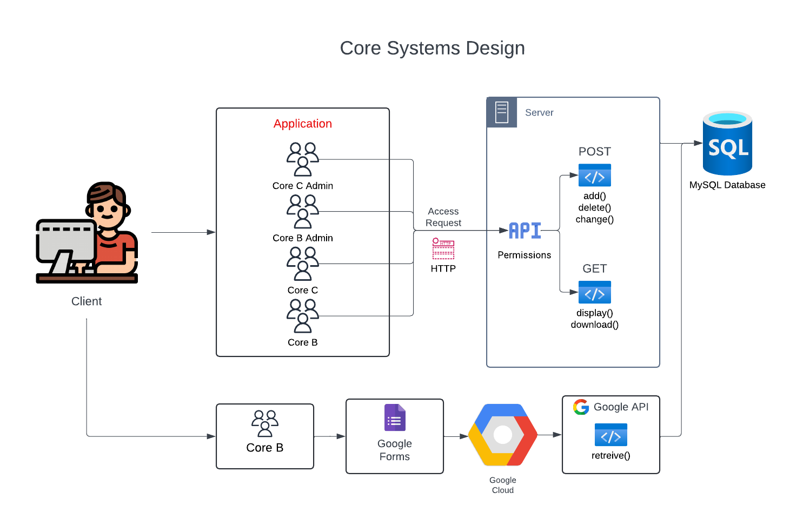

<div align="center">

    
[](https://www.lsuhs.edu/centers/center-for-applied-immunology-and-pathological-processes/bioinformatics-modeling-core) [](https://www.python.org/) [](https://flask.palletsprojects.com/) [](LICENSE) [](https://github.com/LSUHSC-CAIPP-Core-B/CoreSystemsApp/commits/main/)
 
</div>

A lightweight, customizable web system built with Flask for managing the operations of the LSUHSC-CAIPP Bioinformatics and Modeling Cores (Core B and Core C). CoreSystemsApp centralizes order management, invoicing, inventory, and reporting behind a role-based access system, with safe database operations across client-side logic, server-side processing, and API communication.



## Table of Contents
- [Features](#features)
- [Setup](#setup)
- [Roles and Access](#roles-and-access)
- [Web App](#web-app)
  - [Login](#login)
  - [Core B](#core-b)
  - [Core C](#core-c)
  - [Dashboards](#dashboards)
- [Reader](#reader)
- [PdfWriter](#pdfwriter)
- [Development](#development)
- [License](#license)

## Features
- Role-based authentication (Admin, User, Core B, Core C) with a super-admin tier
- Core B: order tracking, PI management, and itemized invoice PDF generation with discounts
- Core C: antibody stock, mouse stock, predefined antibody panels, and supply inventory
- Fuzzy search and filtering across records
- CSV export on every major table
- Orders and Invoice analytics dashboards
- BioRender license billing support

## Setup

Python version required: 3.14.5

Create an environment with:

`python3 -m venv <venv_name>`

or for a specific Python version:

`python3.14 -m venv <venv_name>`

Activate the environment:

`source <venv_name>/bin/activate`

Install requirements:

`pip install -r requirements.txt`

The application uses SQLite by default for user credentials (configurable via the `DATABASE_URI` environment variable) and connects to MySQL databases for Core B and Core C data using the JSON credential files in `db_config/`. See [Database Configuration](#core-b) details in each core's README.

## Roles and Access
Access is governed by a role system enforced through a custom `login_required` decorator. Roles are:

- **Admin** — manage users, including creating and deleting other admins (super-admin can do all)
- **User** — base authenticated access
- **Core B** — access to the Bioinformatics and Modeling order/invoice system
- **Core C** — access to the antibody, mouse, and panel systems

Only super admins (Admin + Core B + Core C) can add and delete users through the Authentication/Admin panel.

## Web App
The app is divided into sections based on access level and function.

### Login
Each user logs in to an account tied to specific roles that determine what they can access. The login system uses *Flask-Login* with custom role checks. After login, users are routed to the appropriate core based on their roles.

### Core B
Order and invoice system for the Bioinformatics and Modeling Core. Handles service orders, PI records, and invoice PDF generation.

For details see [CoreB](app/CoreB/README.md).

### Core C
Antibody sharing and tracking system, including antibody stock, mouse stock, predefined panels, and supply inventory.

For details see [CoreC](app/CoreC/README.md).

### Dashboards
Core B includes Orders and Invoice analytics dashboards that summarize order and billing data into KPIs and charts (BioRender entries are reported separately). Dashboards are generated server-side with matplotlib and rendered into the app.

## PdfWriter
Fills invoice PDF templates from a dictionary of data, populating a predefined invoice form to produce a completed invoice document.

## Development
Linting and formatting use Ruff (Python), HTMLHint (templates), and Stylelint (CSS). Common tasks are available through the Makefile:

```bash
make setup      # install Python + Node dependencies
make run        # run the Flask app
make lint       # lint Python with Ruff
make lint-html  # lint HTML templates
make lint-css   # lint CSS
make format     # format Python with Ruff
```

Tests run with pytest:

```bash
python -m pytest
```

## License
This project is licensed under the GNU General Public License v3.0 — see the [LICENSE](LICENSE) file for details.
