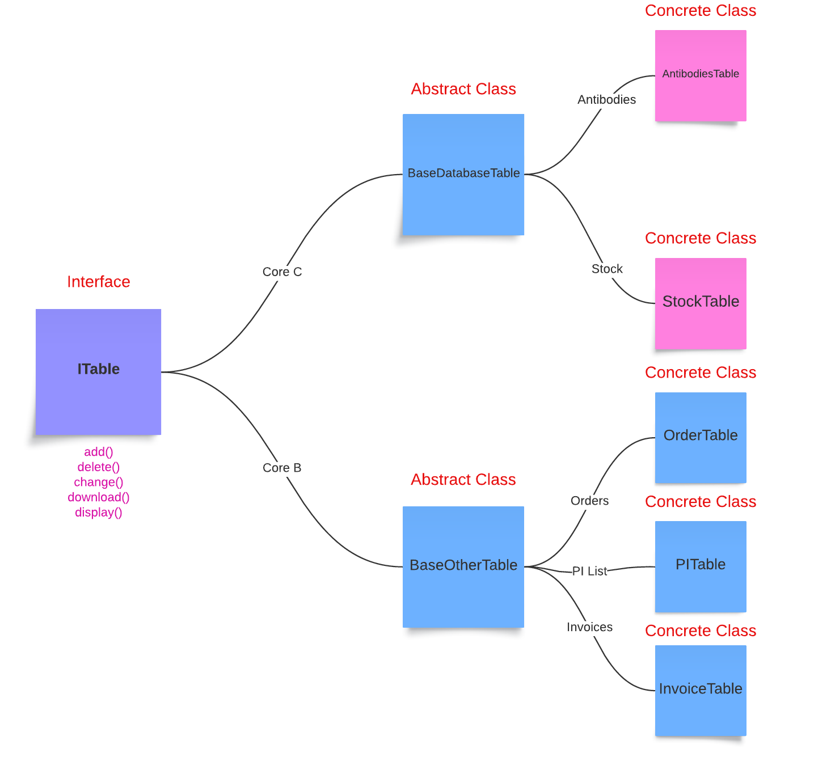

# App

## Table of Contents 
- [Introduction](#Introduction)
- [Credentials](#Credentials)
- [Abstraction](#Abstraction)
- [Utilities](#Utilities)

## Introduction
The `routes.py` files play a crucial role in managing the API endpoints by handling GET and POST requests. Each `routes.py` file defines specific routes and their corresponding request handlers, ensuring that incoming requests are processed and responses are generated.

When adding a new `routes.py` file, it is essential to register it within the [\_\_init\_\_.py](__init__.py) file. This step ensures that Flask includes the new routes in the application's URL routing map. Without this registration, the new routes will not be accessible.

To register a new `routes.py` file, you need to import the blueprint and add it to the Flask application instance in the [\_\_init\_\_.py](__init__.py) file. For example:

```py
from app.CoreB.orders import bp as main_bp
app.register_blueprint(main_bp)
```

## Credentials
The [Credentials](Credentials/) directory houses the database credentials stored in JSON files, facilitating authentication and connection to MySQL databases. Each core module of the application has its own schema credentials stored within this directory, ensuring secure and organized access to the respective databases.

## Abstraction

*This ITable design allows the management of tables with varying levels of abstraction. Starting with a generic interface defining basic operations, then abstract classes providing frameworks for CoreC/CoreB, and finally concrete classes implementing functionalities to individual table types. This design ensures scalability while maintaining organization.*

## Utilities
The [utils](utils/)  directory contains all utility classes and functions essential for the application.

#### Logging Utilities
[logging_utils](utils/logging_utils/) offers configurable logging for the application, allowing for extensive customization.

#### Database Utilities
[db_utils](utils/db_utils.py) class provides functionality for database connection and configuration, ensuring seamless interaction with the database.

#### Search Utilities
[search_utils](utils/search_utils.py) includes a search function designed to perform fuzzy matching within a dataframe, enhancing search accuracy and flexibility.